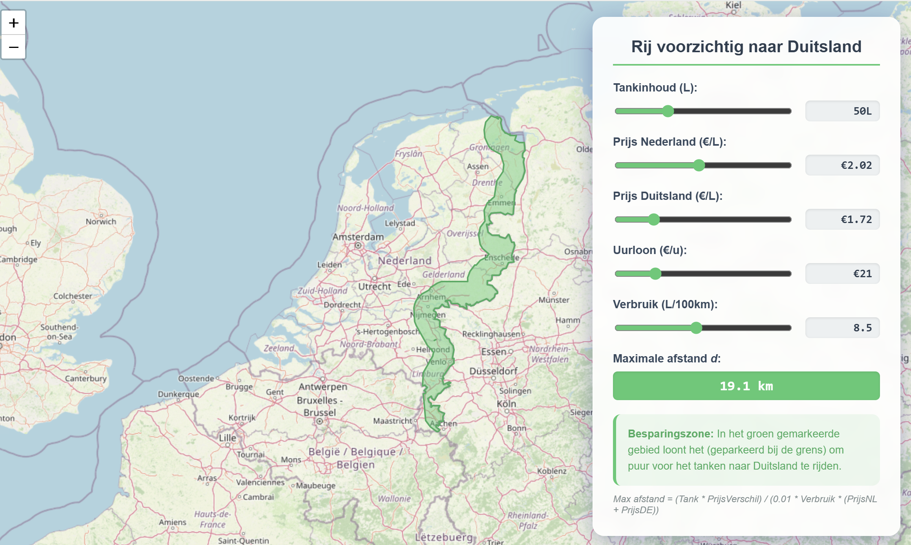

# ⛽ Benzine Besparingskaart NL-DE

Een interactieve web-applicatie die visualiseert vanaf welke locaties in Nederland het financieel voordelig is om de grens over te steken naar Duitsland voor een tankbeurt.

## 🚀 Gebruik
Het project is "all-in-one" gebouwd om problemen met lokale file-beperkingen (CORS) te voorkomen.
1. Download of clone deze repository.
2. Open `index.html` in je browser (bijv. Chrome).
3. Gebruik de schuifbalken om je tankinhoud, benzineprijzen en verbruik aan te passen.
4. De groene 'Besparingszone' op de kaart update automatisch.

## 🧮 De Besparingsformule

De kaart berekent de maximale afstand $d$ (enkele reis) die je kunt rijden naar een Duits tankstation zonder dat de kosten van de extra rit de besparing van de lagere brandstofprijs tenietdoen.

### Variabelen:
- $T$: Tankinhoud in liters (bijv. 50L)
- $P_{NL}$: Benzineprijs in Nederland (€/L)
- $P_{DE}$: Benzineprijs in Duitsland (€/L)
- $C$: Verbruik van de auto (L/100km)
- $d$: Afstand naar de grens in kilometers

### Logica:
Om het omslagpunt te vinden, stellen we de kosten van lokaal tanken gelijk aan de kosten van tanken in Duitsland inclusief de extra gereden kilometers:

$$Kosten_{NL} = Kosten_{DE} + Kosten_{Rit}$$

1. **Kosten NL**: Je vult de hele tank tegen de Nederlandse prijs.
   $$T \cdot P_{NL}$$
2. **Kosten DE**: Je vult de hele tank tegen de Duitse prijs.
   $$T \cdot P_{DE}$$
3. **Kosten Rit**: Je rijdt $d$ kilometer naar Duitsland met Nederlandse brandstof en $d$ kilometer terug met de goedkopere Duitse brandstof.
   $$\text{Verbruik per km} = \frac{C}{100} = 0.01 \cdot C$$
   $$\text{Kosten heenreis} = d \cdot (0.01 \cdot C) \cdot P_{NL}$$
   $$\text{Kosten terugreis} = d \cdot (0.01 \cdot C) \cdot P_{DE}$$
   $$Kosten_{Rit} = 0.01 \cdot d \cdot C \cdot (P_{NL} + P_{DE})$$

### De vergelijking oplossen voor $d$:
$$T \cdot P_{NL} = T \cdot P_{DE} + 0.01 \cdot d \cdot C \cdot (P_{NL} + P_{DE})$$

$$T \cdot (P_{NL} - P_{DE}) = 0.01 \cdot d \cdot C \cdot (P_{NL} + P_{DE})$$

$$d = \frac{T \cdot (P_{NL} - P_{DE})}{0.01 \cdot C \cdot (P_{NL} + P_{DE})}$$

### Voorbeeld:
- Tank: **50L**
- Prijsverschil: **€0.30** (€2.02 vs €1.72)
- Verbruik: **7.0 L/100km**

$$d = \frac{50 \cdot 0.30}{0.01 \cdot 7.0 \cdot (2.02 + 1.72)} = \frac{15}{0.2618} \approx \mathbf{57.3 \text{ km}}$$

In dit scenario loont het dus om tot 57 kilometer van de grens naar Duitsland te rijden.

## 🛠️ Technologie
- **HTML5/CSS3**: Voor de interface en sliders.
- **Leaflet.js**: Voor de interactieve kaart rendering.
- **Turf.js**: Voor de geospatiale berekeningen (buffering en clipping van de grenszone).
- **GeoJSON**: Voor de grenscoördinaten van Nederland.

## ⚖️ Licentie
Dit project is vrij te gebruiken voor persoonlijke doeleinden. Let op: de berekening gaat uit van een 'lege' tank bij aankomst bij de grens en houdt geen rekening met slijtage aan de auto of de waarde van je tijd.
